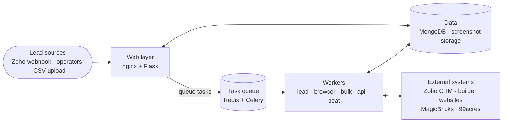
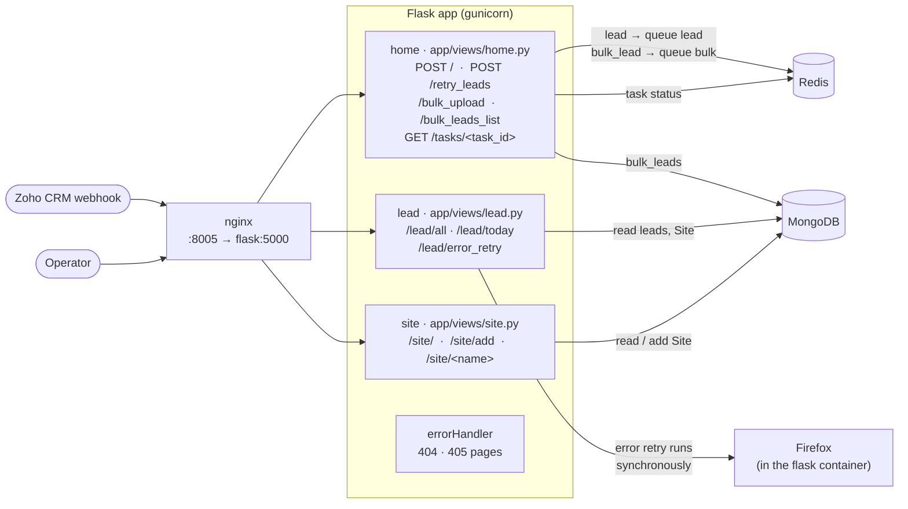
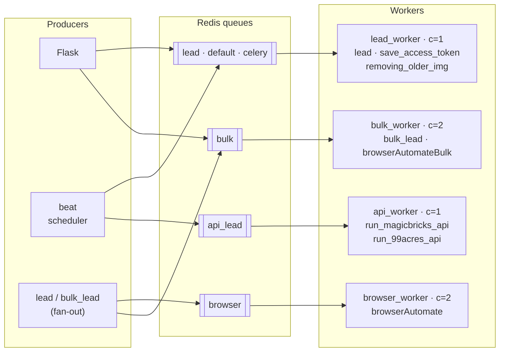
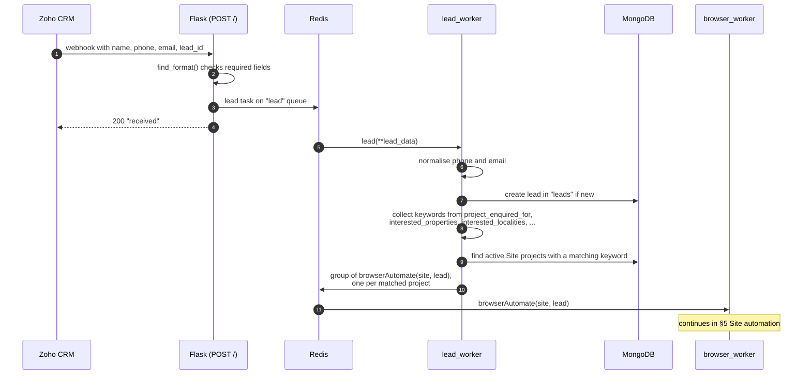
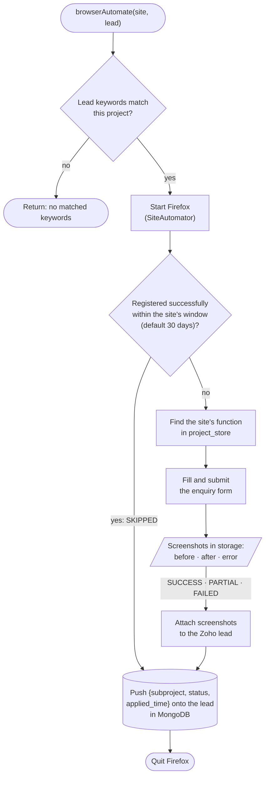
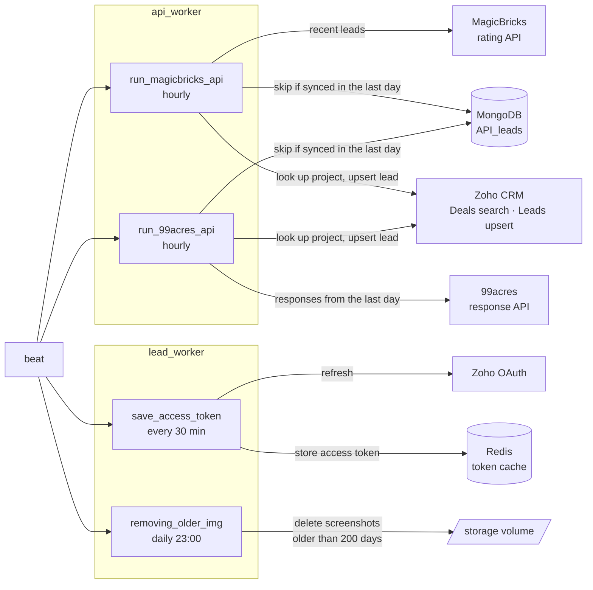

# Architecture

Real-estate lead automation takes property-enquiry leads from Zoho CRM (and from the
MagicBricks and 99acres APIs), matches each lead to builder projects by keyword, and
registers the lead on every matching builder's website with a Selenium-driven Firefox.
Screenshots of each registration are attached back to the Zoho lead.

This page starts with one overview diagram, then shows each part on its own:

1. [Overview](#1-overview)
2. [Web layer](#2-web-layer)
3. [Task queues and workers](#3-task-queues-and-workers)
4. [Lead pipeline](#4-lead-pipeline)
5. [Site automation](#5-site-automation)
6. [Scheduled jobs and portal sync](#6-scheduled-jobs-and-portal-sync)
7. [Data stores](#7-data-stores)

## 1. Overview

| Part | What it does | Details |
| --- | --- | --- |
| Web layer | Receives webhooks, serves the admin pages, queues work | [§2](#2-web-layer) |
| Task queues and workers | Runs every job in the background, split by queue | [§3](#3-task-queues-and-workers) |
| Lead pipeline | Turns one lead into one registration per matching project | [§4](#4-lead-pipeline) |
| Site automation | Fills one builder's enquiry form and records the result | [§5](#5-site-automation) |
| Scheduled jobs | Pulls portal leads, refreshes the Zoho token, cleans up | [§6](#6-scheduled-jobs-and-portal-sync) |
| Data stores | What is kept where, and who reads or writes it | [§7](#7-data-stores) |

Everything runs from `docker-compose.yml` except MongoDB, which is external (Atlas) and set by
`MONGO_URI`. All settings come from `.env`; see `.env.example` and `config.py`.

## 2. Web layer

nginx listens on host port 8005 and proxies to gunicorn (`run:app`, one `gthread` worker with
three threads, 600 s timeout). The Flask app is built in `app/__init__.py` from four blueprints.

- **`POST /`**: the Zoho webhook. `find_format()` reads JSON or form bodies and needs
  `name`, `phone`, `email` and `lead_id`. Valid leads go to the `lead` task.
- **`POST /retry_leads`**: re-queues one lead for one sub-project (`source: retry`).
- **`/bulk_upload`**: stores CSV rows in `bulk_leads` and queues each one as `bulk_lead`.
- **`/lead/error_retry`**: re-runs one site registration inside the web request, without
  Celery, using `error_site_base.SiteAutomator1`.

## 3. Task queues and workers

Every Celery process uses the same app (`app.tasks`). Routing is set in `task_routes` in
`app/tasks.py`, and each worker is started by `worker_starter.sh <role>`.

| Worker | Queues | Concurrency | Firefox |
| --- | --- | --- | --- |
| `lead_worker` | `default`, `lead`, `celery` | 1 | no |
| `browser_worker` | `browser` | `BROWSER_CONCURRENCY` (default 2) | yes, 1 GB shm |
| `bulk_worker` | `bulk` | 2 | yes, 1 GB shm |
| `api_worker` | `api_lead` | 1 | no |
| `beat` | (sends only) | n/a | no |

Bulk leads stay on the `bulk` queue from start to finish, so a large CSV upload doesn't
hold up live Zoho leads on the `browser` queue.

## 4. Lead pipeline

One webhook becomes one browser task for every builder project whose keywords match the lead.

`bulk_lead` does the same with `browserAutomateBulk` on the `bulk` queue. A lead with no
keywords is matched against the `None (default)` keyword instead.

## 5. Site automation

`SiteAutomator` in `app/functions/site_base.py` handles one lead for one builder project. The
form-filling code for each builder lives in `app/functions/browser_automation.py` and is looked
up by site name in `project_store`.

| Status | Value | Meaning | Screenshots attached |
| --- | --- | --- | --- |
| `SKIPPED` | 0 | Already registered with this project inside the window | none |
| `SUCCESS` | 1 | Form submitted | before, after |
| `PARTIAL` | -1 | Submitted, but the site also showed an error | before, after, error |
| `FAILED` | 2 | The automation raised an error, or the site has no function | error, if one was taken |

Firefox is always closed in a `finally`, so a failing site doesn't leave a browser process
running on the worker.

## 6. Scheduled jobs and portal sync

`beat` sends these tasks on the schedule in `beat_schedule` (`app/tasks.py`).

Every Zoho call reads the cached access token from Redis first and only asks Zoho OAuth for a
new one if the cache is empty.

## 7. Data stores

```mermaid
flowchart LR
    subgraph components["Components"]
        direction TB
        flask["Flask"]
        lead_w["lead / bulk_lead"]
        site_auto["Site automation"]
        api_w["Portal sync"]
        token["save_access_token"]
        clean["removing_older_img"]
    end

    subgraph mongo["MongoDB (MONGO_DB_NAME)"]
        direction TB
        Site[("Site<br/>builders, projects, keywords")]
        leads[("leads<br/>one per person + project results")]
        bulk_leads[("bulk_leads<br/>uploaded CSV rows")]
        API_leads[("API_leads<br/>portal sync log")]
    end

    subgraph redis_box["Redis"]
        direction TB
        broker[("Celery broker + results")]
        zoho_token[("lead_automation:zoho_access_token")]
    end

    storage[/"storage volume<br/>screenshots per site + zoho copies"/]

    flask -- "read, add" --> Site
    flask -- read --> leads
    flask -- "write, read" --> bulk_leads
    flask -- "send tasks, read status" --> broker
    lead_w -- read --> Site
    lead_w -- "create lead" --> leads
    site_auto -- "check window, push result" --> leads
    site_auto -- write --> storage
    site_auto & api_w -- read --> zoho_token
    api_w -- "upsert, dedupe" --> API_leads
    token -- write --> zoho_token
    clean -- delete --> storage
```

| Store | Contents | Written by | Read by |
| --- | --- | --- | --- |
| `Site` | Builder sites, their projects and match keywords, active status | `/site/add` | lead matching, admin pages, error retry |
| `leads` | One document per email and phone, with a `project` list of registration results | `lead`, `bulk_lead`, site automation | `/lead/*` pages, window check, error retry |
| `bulk_leads` | Rows from CSV uploads | `/bulk_upload` | `/bulk_leads_list` |
| `API_leads` | Leads already sent from MagicBricks and 99acres | portal sync | portal sync |
| Redis | Celery messages and results; cached Zoho access token | Celery, Zoho token refresh | workers, `/tasks/<id>`, Zoho calls |
| `storage` volume | Screenshots, grouped by site, with copies for Zoho | site automation | Zoho upload, cleanup |
